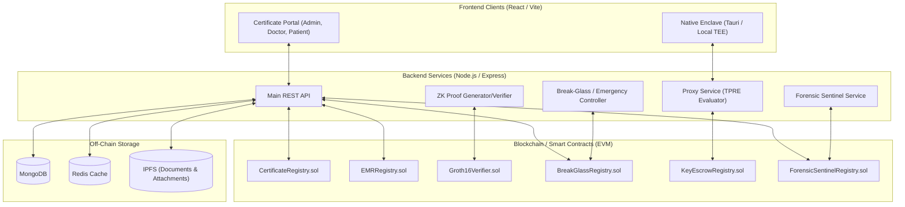
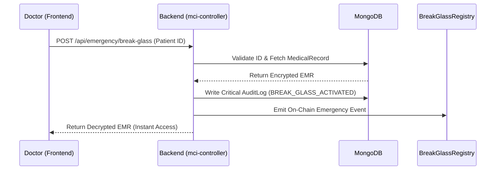

# Kyllang Health Platform - Architecture Overview

Based on a strict analysis of the codebase, here is the architecture of the Kyllang Health Platform. The system implements a hybrid blockchain-database Electronic Medical Record (EMR) system utilizing Zero-Knowledge Proofs (ZKPs) and Threshold Proxy Re-Encryption (TPRE).

## 1. High-Level Architecture Diagram

## 2. Core Components & Modules

### A. Frontend (`/certificate-portal`)
- **Framework**: React via Vite.
- **Role-Based Access Control**: Renders different dashboard views for `hospital_admin`, `doctor`, `general_user`, and `insurance_officer`.
- **Functionality**: EMR management, Certificate issuance/requests, ZK QR Verification, System notifications, Emergency "Break-Glass" access.

### B. Backend API (`/backend`)
- **Framework**: Node.js & Express.
- **Database (MongoDB)**: Stores encrypted medical records (`MedicalRecord`), user identities (`User`), audit logs (`AuditLog`), appointments, lab reports, and temporary escrow data.
- **Caching (Redis)**: Implemented for high-speed retrieval of frequently accessed records (though designed to gracefully bypass if Redis goes down).
- **Decentralized Storage (IPFS)**: Medical attachments and documents are pinned to IPFS, and their CIDs are stored in MongoDB and the blockchain.

### C. Cryptography & Security Modules
- **Zero-Knowledge Proofs (ZKPs)**: Uses `circomlibjs` and `snarkjs` to generate and verify ZK proofs (e.g., `certificate_proof.circom`). This allows verifying a patient's medical certificate or condition without revealing their full identity or medical history.
- **Threshold Proxy Re-Encryption (TPRE)**: Evaluated in the `/proxy-service` and `/proxy-nodes`. Allows patients to delegate decryption rights to doctors without sharing their private keys, using key escrow contracts.
- **Hybrid Envelope Encryption**: Encrypts actual payload data symmetrically, and encrypts the symmetric key using public key infrastructure (PKI), registering keys on-chain.

### D. Blockchain Layer (`/backend/contracts`)
Written in Solidity, deployed to an EVM-compatible network.
- **`CertificateRegistry.sol`**: Maps ZK commitments to on-chain verified hashes.
- **`Groth16Verifier.sol`**: On-chain verification of the `certificate_proof.circom` output.
- **`BreakGlassRegistry.sol` & `EmergencyEscrow.sol`**: Immutable audit logging for when doctors invoke emergency (Break-Glass) overrides, bypassing normal cryptographic access controls.
- **`KeyEscrowRegistry.sol`**: On-chain store for TPRE re-encryption keys and delegated access policies.
- **`ForensicSentinelRegistry.sol`**: Receives anomaly detection alerts from the off-chain `sentinel-service`.

## 3. Data Flow Example: Emergency Break-Glass

