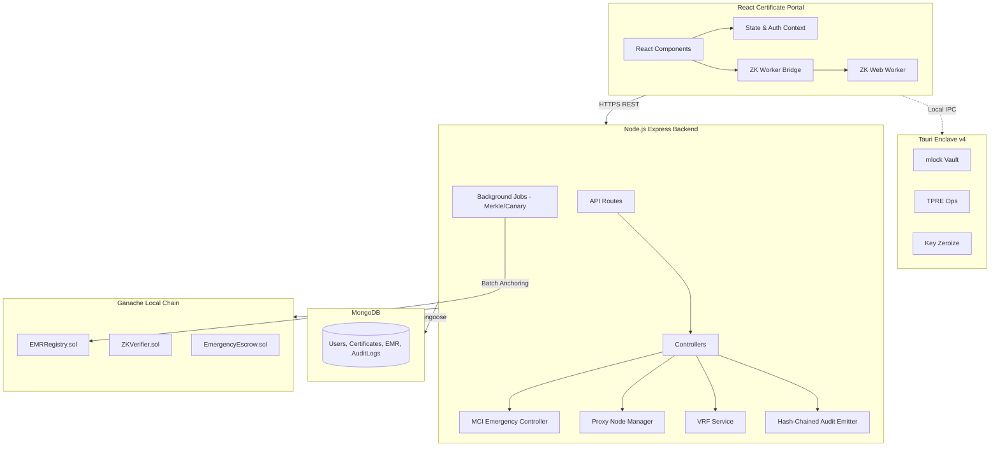
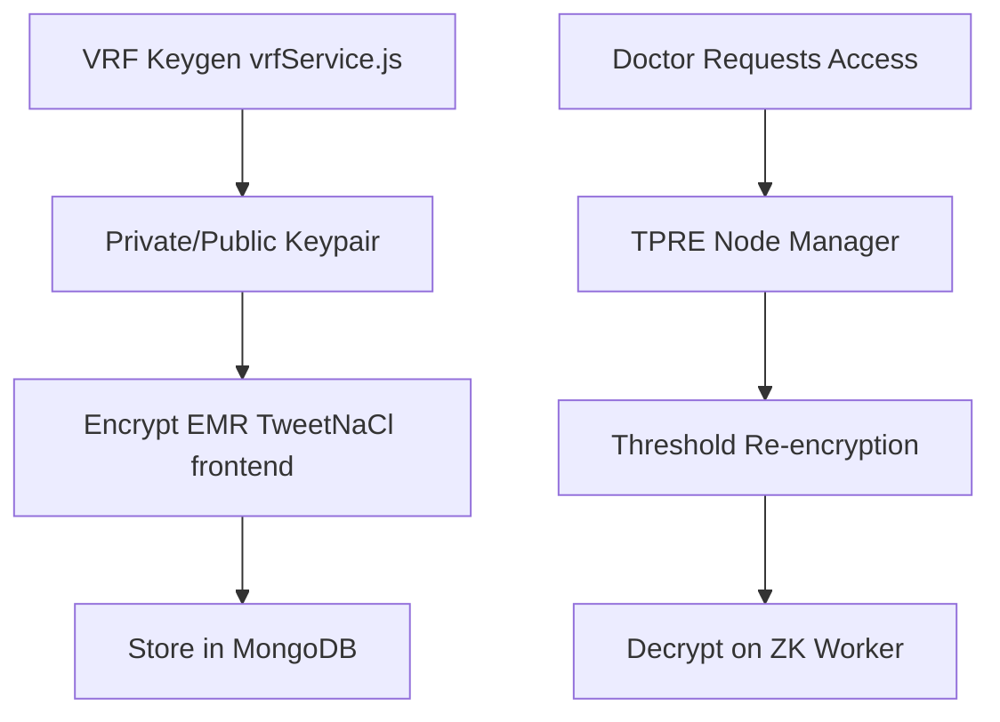
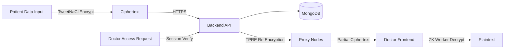
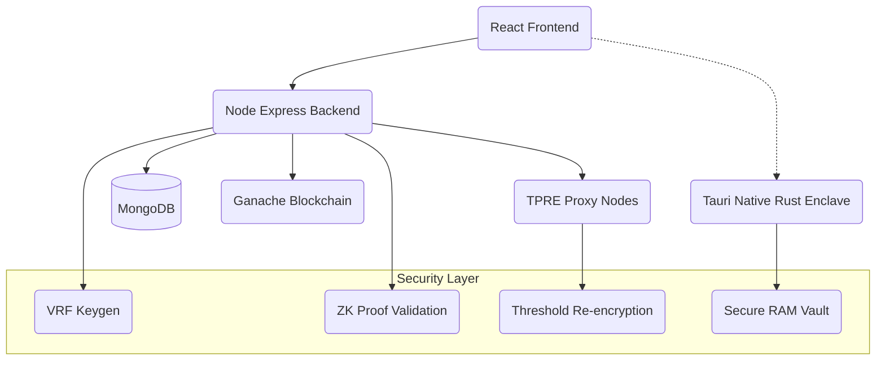

# 1 Executive Summary

- **What this project is:** Kyllang is a full-stack, blockchain-anchored Medical Certificate and Electronic Medical Record (EMR) portal. It features a hardened v4 architecture for decentralized trust, utilizing Zero-Knowledge Proofs (ZKP), Proxy Re-Encryption (PRE), and VRF-based key generation.
- **Problem being solved:** Traditional EMR systems suffer from single points of failure, lack of cryptographic verifiability, browser-based memory volatility, and vulnerable deterministic key generation. Kyllang solves this by decentralizing trust (TPRE), anchoring audit logs immutably (Merkle Roots on Ganache), and securing sessions (on-chain Escrow + ZKP).
- **Target users:** Doctors, Patients, Hospital Administrators, and Insurance Providers.
- **Overall architecture:** 
  - **Frontend:** React 18, Vite, Material-UI, TweetNaCl. Dedicated ZK Web Workers for cryptographic offloading.
  - **Backend:** Node.js, Express.js, MongoDB (Mongoose), Ethers.js.
  - **Blockchain:** Local Ganache running `EMRRegistry.sol`, `ZKVerifier.sol`, and `EmergencyEscrow.sol`.
  - **Native Enclave (v4):** Tauri-based Rust sidecar for secure memory (mlock) and key zeroization.
- **Current completion percentage:** 85% (Core logic, crypto v4 hardened architecture completed. Native enclave scaffolded but pending full UI integration and build).

────────────────────────────────────────────
# 2 Repository Structure

```text
d:/Kyllang/Kyllang-main
├── backend/                  # Node.js Express backend and APIs
│   ├── contracts/            # Solidity smart contracts
│   ├── controllers/          # API route controllers
│   ├── emergency/            # MCI Break-glass controllers
│   ├── events/               # Event emitters (Audit hash-chaining)
│   ├── jobs/                 # Background workers (Merkle, Canary, Backup)
│   ├── middlewares/          # Express middlewares (Auth, Sanitize)
│   ├── models/               # Mongoose schemas
│   ├── proxy-nodes/          # TPRE Proxy Node manager and VSS logic
│   ├── routes/               # API route definitions
│   ├── services/             # Core business logic (VRF, KMS)
│   └── utils/                # Helper functions (Crypto, IPFS)
├── certificate-portal/       # React 18 Frontend
│   ├── public/               # Static assets
│   └── src/                  # React source code
│       ├── components/       # UI Components (Pages, Layouts, Dialogs)
│       ├── contexts/         # React Contexts (Auth, Data)
│       ├── dashboard/        # Dashboard specific views
│       ├── modules/          # Domain-specific modules (EMR)
│       ├── utils/            # Frontend utilities (API, Crypto)
│       └── workers/          # ZK Web Worker and Bridge for crypto offloading
└── native-enclave/           # Tauri (Rust) sidecar for secure key management
    └── src-tauri/
        └── src/
            └── crypto/       # mlock, zeroize, TPRE ops
```

**Responsibilities:**
- `backend`: Handles REST APIs, DB connections, smart contract interactions, and background batching.
- `certificate-portal`: Renders UI, offloads crypto to workers, manages JWT/Refresh tokens.
- `native-enclave`: Protects against browser memory dumping by managing keys in a secure native OS process.

────────────────────────────────────────────
# 3 File Inventory

### File: `generate_inventory.js`
- **Purpose:** Application logic
- **Classes:** None
- **Functions:** walkSync
- **Dependencies:** fs, path
- **Interactions:** Interacts with modules imported in its dependencies. Core logic flows through controllers to services and models.

### File: `package-lock.json`
- **Purpose:** Application logic
- **Classes:** None
- **Functions:** None
- **Dependencies:** None
- **Interactions:** Interacts with modules imported in its dependencies. Core logic flows through controllers to services and models.

### File: `package.json`
- **Purpose:** Application logic
- **Classes:** None
- **Functions:** None
- **Dependencies:** None
- **Interactions:** Interacts with modules imported in its dependencies. Core logic flows through controllers to services and models.

### File: `README.md`
- **Purpose:** Application logic
- **Classes:** None
- **Functions:** None
- **Dependencies:** None
- **Interactions:** Interacts with modules imported in its dependencies. Core logic flows through controllers to services and models.

### File: `backend/app.js`
- **Purpose:** Application logic
- **Classes:** None
- **Functions:** storeHash, getAnchor, getTotalAnchors, storeHash
- **Dependencies:** dotenv, ethers
- **Interactions:** Interacts with modules imported in its dependencies. Core logic flows through controllers to services and models.

### File: `backend/blockchain.js`
- **Purpose:** Application logic
- **Classes:** None
- **Functions:** storeHash, getAnchor, getTotalAnchors, owner, storeEMRRecord, getEMRRecord, getTotalEMRRecords, getPatientRecordIndices, verifyRecordHash, isNullifierConsumed...
- **Dependencies:** ethers, dotenv, ./blockchain
- **Interactions:** Interacts with modules imported in its dependencies. Core logic flows through controllers to services and models.

### File: `backend/check-hash.js`
- **Purpose:** Application logic
- **Classes:** None
- **Functions:** run
- **Dependencies:** mongoose, crypto, ./models/Certificate, fs, dotenv
- **Interactions:** Interacts with modules imported in its dependencies. Core logic flows through controllers to services and models.

### File: `backend/deploy.js`
- **Purpose:** Application logic
- **Classes:** None
- **Functions:** main
- **Dependencies:** path, fs, solc, ethers
- **Interactions:** Interacts with modules imported in its dependencies. Core logic flows through controllers to services and models.

### File: `backend/eslint.config.js`
- **Purpose:** Application logic
- **Classes:** None
- **Functions:** None
- **Dependencies:** @eslint/js
- **Interactions:** Interacts with modules imported in its dependencies. Core logic flows through controllers to services and models.

### File: `backend/index.js`
- **Purpose:** Application logic
- **Classes:** None
- **Functions:** None
- **Dependencies:** dotenv, express, mongoose, cors, helmet, cookie-parser, path, ./middlewares/mongoSanitizeMiddleware, ./src/middlewares/metricsMiddleware, express-rate-limit, ./routes/authRoutes, ./routes/certificateRoutes, ./routes/adminRoutes, ./routes/doctorRoutes, ./routes/emergencyRoutes, ./routes/patientRoutes, ./src/modules/emr/emrRoutes, ./src/modules/prescriptions/prescriptionRoutes, ./src/modules/lab/labReportRoutes, ./routes/uploadRoutes, ./src/modules/insurance/insuranceRoutes, ./src/modules/consent/consentRoutes, ./src/modules/secure-storage/routes/storageRoutes, ./src/modules/scheduling/appointmentRoutes, swagger-ui-express, yamljs, ./middlewares/errorHandler, ./src/jobs/blockchainWorker, ./src/jobs/backupWorker, ./src/jobs/merkleAnchorWorker, ./src/jobs/canaryScanner, ./blockchain, ./src/config/redisClient
- **Interactions:** Interacts with modules imported in its dependencies. Core logic flows through controllers to services and models.

### File: `backend/migrate-folders.js`
- **Purpose:** Application logic
- **Classes:** None
- **Functions:** copyFiles
- **Dependencies:** fs, path
- **Interactions:** Interacts with modules imported in its dependencies. Core logic flows through controllers to services and models.

### File: `backend/mock-qr-payload.js`
- **Purpose:** Application logic
- **Classes:** None
- **Functions:** run
- **Dependencies:** mongoose, ./models/Certificate, crypto, dotenv
- **Interactions:** Interacts with modules imported in its dependencies. Core logic flows through controllers to services and models.

### File: `backend/package-lock.json`
- **Purpose:** Application logic
- **Classes:** None
- **Functions:** None
- **Dependencies:** None
- **Interactions:** Interacts with modules imported in its dependencies. Core logic flows through controllers to services and models.

### File: `backend/package.json`
- **Purpose:** Application logic
- **Classes:** None
- **Functions:** None
- **Dependencies:** None
- **Interactions:** Interacts with modules imported in its dependencies. Core logic flows through controllers to services and models.

### File: `backend/seed.js`
- **Purpose:** Application logic
- **Classes:** None
- **Functions:** seedData
- **Dependencies:** mongoose, ./models/User, dotenv
- **Interactions:** Interacts with modules imported in its dependencies. Core logic flows through controllers to services and models.

### File: `backend/test-api.js`
- **Purpose:** Application logic
- **Classes:** None
- **Functions:** None
- **Dependencies:** http
- **Interactions:** Interacts with modules imported in its dependencies. Core logic flows through controllers to services and models.

### File: `backend/test-blockchain-force.js`
- **Purpose:** Application logic
- **Classes:** None
- **Functions:** test
- **Dependencies:** None
- **Interactions:** Interacts with modules imported in its dependencies. Core logic flows through controllers to services and models.

### File: `backend/test-blockchain.js`
- **Purpose:** Application logic
- **Classes:** None
- **Functions:** testAnchor
- **Dependencies:** http
- **Interactions:** Interacts with modules imported in its dependencies. Core logic flows through controllers to services and models.

### File: `backend/test-read.js`
- **Purpose:** Application logic
- **Classes:** None
- **Functions:** checkGanacheState, anchors, getTotalAnchors
- **Dependencies:** ethers
- **Interactions:** Interacts with modules imported in its dependencies. Core logic flows through controllers to services and models.

### File: `backend/test-storeHash.js`
- **Purpose:** Application logic
- **Classes:** None
- **Functions:** storeHash, getAnchor, getTotalAnchors, storeHash
- **Dependencies:** ethers
- **Interactions:** Interacts with modules imported in its dependencies. Core logic flows through controllers to services and models.

### File: `backend/test-tx.js`
- **Purpose:** Application logic
- **Classes:** None
- **Functions:** checkTx, storeHash
- **Dependencies:** ./app, dotenv, ethers
- **Interactions:** Interacts with modules imported in its dependencies. Core logic flows through controllers to services and models.

### File: `backend/test-verify.js`
- **Purpose:** Application logic
- **Classes:** None
- **Functions:** None
- **Dependencies:** http
- **Interactions:** Interacts with modules imported in its dependencies. Core logic flows through controllers to services and models.

### File: `backend/test_assign.js`
- **Purpose:** Application logic
- **Classes:** None
- **Functions:** test
- **Dependencies:** None
- **Interactions:** Interacts with modules imported in its dependencies. Core logic flows through controllers to services and models.

### File: `backend/test_mongoose_save.js`
- **Purpose:** Application logic
- **Classes:** None
- **Functions:** test
- **Dependencies:** mongoose, ./models/User
- **Interactions:** Interacts with modules imported in its dependencies. Core logic flows through controllers to services and models.

### File: `backend/contracts/EmergencyEscrow.sol`
- **Purpose:** Solidity Smart Contract
- **Classes:** EmergencyEscrow
- **Functions:** openSession, closeSession, getSession, setMCI
- **Dependencies:** None
- **Interactions:** Interacts with modules imported in its dependencies. Core logic flows through controllers to services and models.

### File: `backend/contracts/EMRRegistry.sol`
- **Purpose:** Solidity Smart Contract
- **Classes:** EMRRegistry
- **Functions:** storeHash, getAnchor, getTotalAnchors, storeEMRRecord, getEMRRecord, getTotalEMRRecords, getPatientRecordIndices, verifyRecordHash
- **Dependencies:** None
- **Interactions:** Interacts with modules imported in its dependencies. Core logic flows through controllers to services and models.

### File: `backend/contracts/ZKVerifier.sol`
- **Purpose:** Solidity Smart Contract
- **Classes:** ZKVerifier
- **Functions:** isNullifierConsumed, consumeNullifier, setSriHash
- **Dependencies:** None
- **Interactions:** Interacts with modules imported in its dependencies. Core logic flows through controllers to services and models.

### File: `backend/controllers/adminController.js`
- **Purpose:** API Request Handler
- **Classes:** None
- **Functions:** None
- **Dependencies:** ../models/User, ../models/Certificate, ../models/AuditLog, ../blockchain, ../src/modules/secure-storage/models/SecureFile, os, ../src/middlewares/metricsMiddleware, crypto, tweetnacl, tweetnacl-util, ../models/PatientDocument
- **Interactions:** Interacts with modules imported in its dependencies. Core logic flows through controllers to services and models.

### File: `backend/controllers/authController.js`
- **Purpose:** API Request Handler
- **Classes:** None
- **Functions:** generateAccessToken, generateRefreshToken, setTokensInCookies
- **Dependencies:** ../models/User, ../models/RefreshToken, jsonwebtoken, crypto
- **Interactions:** Interacts with modules imported in its dependencies. Core logic flows through controllers to services and models.

### File: `backend/controllers/certificateController.js`
- **Purpose:** API Request Handler
- **Classes:** None
- **Functions:** None
- **Dependencies:** crypto, ../models/Certificate, ../models/MedicalRecord, ../models/Doctor, ../models/AuditLog, ../blockchain, ../blockchain
- **Interactions:** Interacts with modules imported in its dependencies. Core logic flows through controllers to services and models.

### File: `backend/controllers/doctorController.js`
- **Purpose:** API Request Handler
- **Classes:** None
- **Functions:** None
- **Dependencies:** ../models/User, fs, ../models/Certificate, ../models/PatientDocument, ../models/AuditLog, ../models/MedicalRecord, ../models/Doctor, ../blockchain, ../src/modules/secure-storage/services/storageService, crypto, ../services/vrfService, ../proxy-nodes/session-proof-verifier, ../models/CertificateRequest
- **Interactions:** Interacts with modules imported in its dependencies. Core logic flows through controllers to services and models.

### File: `backend/controllers/patientController.js`
- **Purpose:** API Request Handler
- **Classes:** None
- **Functions:** None
- **Dependencies:** ../models/PatientDocument, ../models/CertificateRequest, ../models/AuditLog, ../models/User, ../models/Certificate
- **Interactions:** Interacts with modules imported in its dependencies. Core logic flows through controllers to services and models.

### File: `backend/controllers/uploadController.js`
- **Purpose:** API Request Handler
- **Classes:** None
- **Functions:** None
- **Dependencies:** crypto, fs, path, ../models/AuditLog, ../services/ipfsService
- **Interactions:** Interacts with modules imported in its dependencies. Core logic flows through controllers to services and models.

### File: `backend/emergency/mci-controller.js`
- **Purpose:** Application logic
- **Classes:** None
- **Functions:** None
- **Dependencies:** ../blockchain, ../models/User
- **Interactions:** Interacts with modules imported in its dependencies. Core logic flows through controllers to services and models.

### File: `backend/middlewares/authMiddleware.js`
- **Purpose:** Application logic
- **Classes:** None
- **Functions:** protect, authorize
- **Dependencies:** jsonwebtoken, ../models/User
- **Interactions:** Interacts with modules imported in its dependencies. Core logic flows through controllers to services and models.

### File: `backend/middlewares/consentMiddleware.js`
- **Purpose:** Application logic
- **Classes:** None
- **Functions:** hasActiveConsent, verifyConsent
- **Dependencies:** ../models/Consent, ../models/Patient, ../models/User
- **Interactions:** Interacts with modules imported in its dependencies. Core logic flows through controllers to services and models.

### File: `backend/middlewares/errorHandler.js`
- **Purpose:** Application logic
- **Classes:** None
- **Functions:** errorHandler
- **Dependencies:** None
- **Interactions:** Interacts with modules imported in its dependencies. Core logic flows through controllers to services and models.

### File: `backend/middlewares/mongoSanitizeMiddleware.js`
- **Purpose:** Application logic
- **Classes:** None
- **Functions:** None
- **Dependencies:** express-mongo-sanitize
- **Interactions:** Interacts with modules imported in its dependencies. Core logic flows through controllers to services and models.

### File: `backend/middlewares/rateLimiter.js`
- **Purpose:** Application logic
- **Classes:** None
- **Functions:** createLimiter
- **Dependencies:** express-rate-limit
- **Interactions:** Interacts with modules imported in its dependencies. Core logic flows through controllers to services and models.

### File: `backend/middlewares/uploadMiddleware.js`
- **Purpose:** Application logic
- **Classes:** None
- **Functions:** fileFilter
- **Dependencies:** multer, path, fs
- **Interactions:** Interacts with modules imported in its dependencies. Core logic flows through controllers to services and models.

### File: `backend/middlewares/validatorMiddleware.js`
- **Purpose:** Application logic
- **Classes:** None
- **Functions:** None
- **Dependencies:** express-validator
- **Interactions:** Interacts with modules imported in its dependencies. Core logic flows through controllers to services and models.

### File: `backend/models/Appointment.js`
- **Purpose:** Mongoose Database Schema Definition
- **Classes:** None
- **Functions:** None
- **Dependencies:** mongoose
- **Interactions:** Interacts with modules imported in its dependencies. Core logic flows through controllers to services and models.

### File: `backend/models/AuditLog.js`
- **Purpose:** Mongoose Database Schema Definition
- **Classes:** None
- **Functions:** None
- **Dependencies:** mongoose
- **Interactions:** Interacts with modules imported in its dependencies. Core logic flows through controllers to services and models.

### File: `backend/models/Certificate.js`
- **Purpose:** Mongoose Database Schema Definition
- **Classes:** None
- **Functions:** None
- **Dependencies:** mongoose
- **Interactions:** Interacts with modules imported in its dependencies. Core logic flows through controllers to services and models.

### File: `backend/models/CertificateRequest.js`
- **Purpose:** Mongoose Database Schema Definition
- **Classes:** None
- **Functions:** None
- **Dependencies:** mongoose
- **Interactions:** Interacts with modules imported in its dependencies. Core logic flows through controllers to services and models.

### File: `backend/models/Consent.js`
- **Purpose:** Mongoose Database Schema Definition
- **Classes:** None
- **Functions:** None
- **Dependencies:** mongoose
- **Interactions:** Interacts with modules imported in its dependencies. Core logic flows through controllers to services and models.

### File: `backend/models/Doctor.js`
- **Purpose:** Mongoose Database Schema Definition
- **Classes:** None
- **Functions:** None
- **Dependencies:** mongoose
- **Interactions:** Interacts with modules imported in its dependencies. Core logic flows through controllers to services and models.

### File: `backend/models/InsuranceClaim.js`
- **Purpose:** Mongoose Database Schema Definition
- **Classes:** None
- **Functions:** None
- **Dependencies:** mongoose
- **Interactions:** Interacts with modules imported in its dependencies. Core logic flows through controllers to services and models.

### File: `backend/models/LabReport.js`
- **Purpose:** Mongoose Database Schema Definition
- **Classes:** None
- **Functions:** None
- **Dependencies:** mongoose
- **Interactions:** Interacts with modules imported in its dependencies. Core logic flows through controllers to services and models.

### File: `backend/models/MedicalCertificate.js`
- **Purpose:** Mongoose Database Schema Definition
- **Classes:** None
- **Functions:** None
- **Dependencies:** ./Certificate
- **Interactions:** Interacts with modules imported in its dependencies. Core logic flows through controllers to services and models.

### File: `backend/models/MedicalRecord.js`
- **Purpose:** Mongoose Database Schema Definition
- **Classes:** None
- **Functions:** None
- **Dependencies:** mongoose
- **Interactions:** Interacts with modules imported in its dependencies. Core logic flows through controllers to services and models.

### File: `backend/models/Patient.js`
- **Purpose:** Mongoose Database Schema Definition
- **Classes:** None
- **Functions:** None
- **Dependencies:** mongoose
- **Interactions:** Interacts with modules imported in its dependencies. Core logic flows through controllers to services and models.

### File: `backend/models/PatientDocument.js`
- **Purpose:** Mongoose Database Schema Definition
- **Classes:** None
- **Functions:** None
- **Dependencies:** mongoose
- **Interactions:** Interacts with modules imported in its dependencies. Core logic flows through controllers to services and models.

### File: `backend/models/Prescription.js`
- **Purpose:** Mongoose Database Schema Definition
- **Classes:** None
- **Functions:** None
- **Dependencies:** mongoose
- **Interactions:** Interacts with modules imported in its dependencies. Core logic flows through controllers to services and models.

### File: `backend/models/RefreshToken.js`
- **Purpose:** Mongoose Database Schema Definition
- **Classes:** None
- **Functions:** None
- **Dependencies:** mongoose
- **Interactions:** Interacts with modules imported in its dependencies. Core logic flows through controllers to services and models.

### File: `backend/models/User.js`
- **Purpose:** Mongoose Database Schema Definition
- **Classes:** None
- **Functions:** None
- **Dependencies:** mongoose, bcryptjs
- **Interactions:** Interacts with modules imported in its dependencies. Core logic flows through controllers to services and models.

### File: `backend/proxy-nodes/node-manager.js`
- **Purpose:** TPRE Distributed Trust Logic
- **Classes:** None
- **Functions:** distributeShares, collectAndReencrypt
- **Dependencies:** ./pedersen-vss, ./tpre-evaluator
- **Interactions:** Interacts with modules imported in its dependencies. Core logic flows through controllers to services and models.

### File: `backend/proxy-nodes/pedersen-vss.js`
- **Purpose:** TPRE Distributed Trust Logic
- **Classes:** None
- **Functions:** splitSecret, evaluate, verifyShare
- **Dependencies:** crypto
- **Interactions:** Interacts with modules imported in its dependencies. Core logic flows through controllers to services and models.

### File: `backend/proxy-nodes/session-proof-verifier.js`
- **Purpose:** TPRE Distributed Trust Logic
- **Classes:** None
- **Functions:** verifySessionOnChain
- **Dependencies:** ../blockchain
- **Interactions:** Interacts with modules imported in its dependencies. Core logic flows through controllers to services and models.

### File: `backend/proxy-nodes/tpre-evaluator.js`
- **Purpose:** TPRE Distributed Trust Logic
- **Classes:** None
- **Functions:** throws, evaluatePartialReencryption
- **Dependencies:** ./session-proof-verifier, crypto
- **Interactions:** Interacts with modules imported in its dependencies. Core logic flows through controllers to services and models.

### File: `backend/routes/adminRoutes.js`
- **Purpose:** Express Router Definition
- **Classes:** None
- **Functions:** None
- **Dependencies:** express, ../controllers/adminController, ../middlewares/authMiddleware
- **Interactions:** Interacts with modules imported in its dependencies. Core logic flows through controllers to services and models.

### File: `backend/routes/authRoutes.js`
- **Purpose:** Express Router Definition
- **Classes:** None
- **Functions:** None
- **Dependencies:** express, ../controllers/authController, ../middlewares/authMiddleware, ../validators/authValidator, ../middlewares/validatorMiddleware, ../middlewares/rateLimiter
- **Interactions:** Interacts with modules imported in its dependencies. Core logic flows through controllers to services and models.

### File: `backend/routes/certificateRoutes.js`
- **Purpose:** Express Router Definition
- **Classes:** None
- **Functions:** None
- **Dependencies:** express, ../src/middlewares/cacheMiddleware, ../controllers/certificateController, ../middlewares/authMiddleware, ../middlewares/rateLimiter, ../validators/certificateValidator, ../middlewares/validatorMiddleware
- **Interactions:** Interacts with modules imported in its dependencies. Core logic flows through controllers to services and models.

### File: `backend/routes/doctorRoutes.js`
- **Purpose:** Express Router Definition
- **Classes:** None
- **Functions:** None
- **Dependencies:** express, ../src/middlewares/cacheMiddleware, multer, fs, path, ../controllers/doctorController, ../src/modules/doctors/doctorController, ../middlewares/authMiddleware, ../middlewares/rateLimiter, ../validators/authValidator, ../validators/emrValidator, ../validators/certificateValidator, ../middlewares/validatorMiddleware
- **Interactions:** Interacts with modules imported in its dependencies. Core logic flows through controllers to services and models.

### File: `backend/routes/emergencyRoutes.js`
- **Purpose:** Express Router Definition
- **Classes:** None
- **Functions:** None
- **Dependencies:** express, ../emergency/mci-controller, ../middlewares/authMiddleware
- **Interactions:** Interacts with modules imported in its dependencies. Core logic flows through controllers to services and models.

### File: `backend/routes/patientRoutes.js`
- **Purpose:** Express Router Definition
- **Classes:** None
- **Functions:** None
- **Dependencies:** express, ../src/middlewares/cacheMiddleware, ../controllers/patientController, ../src/modules/patients/patientController, ../middlewares/authMiddleware, ../middlewares/rateLimiter, ../validators/authValidator, ../middlewares/validatorMiddleware
- **Interactions:** Interacts with modules imported in its dependencies. Core logic flows through controllers to services and models.

### File: `backend/routes/uploadRoutes.js`
- **Purpose:** Express Router Definition
- **Classes:** None
- **Functions:** None
- **Dependencies:** express, ../middlewares/uploadMiddleware, ../controllers/uploadController, ../middlewares/authMiddleware
- **Interactions:** Interacts with modules imported in its dependencies. Core logic flows through controllers to services and models.

### File: `backend/scripts/e2e-integration-test.js`
- **Purpose:** Application logic
- **Classes:** None
- **Functions:** generateToken, setupTestData, runTests
- **Dependencies:** fs, path, mongoose, ../models/User, ../models/Patient, ../models/Consent, jsonwebtoken, dotenv, ../index
- **Interactions:** Interacts with modules imported in its dependencies. Core logic flows through controllers to services and models.

### File: `backend/scripts/test-comprehensive.js`
- **Purpose:** Application logic
- **Classes:** None
- **Functions:** generateToken, setupTestData, runTests
- **Dependencies:** path, mongoose, ../models/User, ../models/Patient, ../models/MedicalRecord, ../models/Certificate, ../models/InsuranceClaim, ../models/AuditLog, ../src/modules/secure-storage/models/FileVersion, jsonwebtoken, dotenv, ../index, crypto
- **Interactions:** Interacts with modules imported in its dependencies. Core logic flows through controllers to services and models.

### File: `backend/scripts/test-insurance-storage.js`
- **Purpose:** Application logic
- **Classes:** None
- **Functions:** generateToken, runTests
- **Dependencies:** fs, path, mongoose, ../models/User, ../models/Patient, ../models/InsuranceClaim, jsonwebtoken, dotenv, ../index
- **Interactions:** Interacts with modules imported in its dependencies. Core logic flows through controllers to services and models.

### File: `backend/services/ipfsService.js`
- **Purpose:** Application logic
- **Classes:** None
- **Functions:** computeFallbackCID
- **Dependencies:** crypto, fs
- **Interactions:** Interacts with modules imported in its dependencies. Core logic flows through controllers to services and models.

### File: `backend/services/vrfService.js`
- **Purpose:** Application logic
- **Classes:** None
- **Functions:** generateLookupToken, verifyLookupToken
- **Dependencies:** crypto
- **Interactions:** Interacts with modules imported in its dependencies. Core logic flows through controllers to services and models.

### File: `backend/src/config/db.js`
- **Purpose:** Application logic
- **Classes:** None
- **Functions:** connectDB
- **Dependencies:** mongoose, ./env
- **Interactions:** Interacts with modules imported in its dependencies. Core logic flows through controllers to services and models.

### File: `backend/src/config/env.js`
- **Purpose:** Application logic
- **Classes:** None
- **Functions:** None
- **Dependencies:** dotenv
- **Interactions:** Interacts with modules imported in its dependencies. Core logic flows through controllers to services and models.

### File: `backend/src/config/redisClient.js`
- **Purpose:** Application logic
- **Classes:** None
- **Functions:** connectRedis
- **Dependencies:** redis
- **Interactions:** Interacts with modules imported in its dependencies. Core logic flows through controllers to services and models.

### File: `backend/src/config/web3.js`
- **Purpose:** Application logic
- **Classes:** None
- **Functions:** None
- **Dependencies:** ../../blockchain
- **Interactions:** Interacts with modules imported in its dependencies. Core logic flows through controllers to services and models.

### File: `backend/src/events/auditEmitter.js`
- **Purpose:** Application logic
- **Classes:** AuditEmitter
- **Functions:** computeChainHash
- **Dependencies:** events, ../../models/AuditLog, ../config/redisClient, crypto
- **Interactions:** Interacts with modules imported in its dependencies. Core logic flows through controllers to services and models.

### File: `backend/src/jobs/backupWorker.js`
- **Purpose:** Background Job / Cron Worker
- **Classes:** None
- **Functions:** None
- **Dependencies:** ../services/backupService
- **Interactions:** Interacts with modules imported in its dependencies. Core logic flows through controllers to services and models.

### File: `backend/src/jobs/blockchainWorker.js`
- **Purpose:** Background Job / Cron Worker
- **Classes:** None
- **Functions:** processPendingTransactions, startBlockchainWorker, stopBlockchainWorker
- **Dependencies:** mongoose, ../modules/secure-storage/models/FileVersion, ../../blockchain, ../modules/secure-storage/models/SecureFile
- **Interactions:** Interacts with modules imported in its dependencies. Core logic flows through controllers to services and models.

### File: `backend/src/jobs/canaryScanner.js`
- **Purpose:** Background Job / Cron Worker
- **Classes:** None
- **Functions:** scanDormantRecords, quarantineRecord, startCanaryScanner, stopCanaryScanner
- **Dependencies:** ../../models/Certificate, ../../models/AuditLog, crypto
- **Interactions:** Interacts with modules imported in its dependencies. Core logic flows through controllers to services and models.

### File: `backend/src/jobs/merkleAnchorWorker.js`
- **Purpose:** Background Job / Cron Worker
- **Classes:** None
- **Functions:** buildMerkleRoot, anchorBatch, startMerkleAnchorWorker, stopMerkleAnchorWorker
- **Dependencies:** crypto, ../../models/AuditLog
- **Interactions:** Interacts with modules imported in its dependencies. Core logic flows through controllers to services and models.

### File: `backend/src/middlewares/cacheMiddleware.js`
- **Purpose:** Application logic
- **Classes:** None
- **Functions:** cacheRoute, invalidateCache
- **Dependencies:** ../config/redisClient
- **Interactions:** Interacts with modules imported in its dependencies. Core logic flows through controllers to services and models.

### File: `backend/src/middlewares/metricsMiddleware.js`
- **Purpose:** Application logic
- **Classes:** None
- **Functions:** trackMetrics, getMetrics
- **Dependencies:** None
- **Interactions:** Interacts with modules imported in its dependencies. Core logic flows through controllers to services and models.

### File: `backend/src/models/Appointment.js`
- **Purpose:** Mongoose Database Schema Definition
- **Classes:** None
- **Functions:** None
- **Dependencies:** mongoose
- **Interactions:** Interacts with modules imported in its dependencies. Core logic flows through controllers to services and models.

### File: `backend/src/models/index.js`
- **Purpose:** Mongoose Database Schema Definition
- **Classes:** None
- **Functions:** None
- **Dependencies:** ../../models/User, ../../models/Patient, ../../models/Doctor, ../../models/MedicalRecord, ../../models/Prescription, ../../models/LabReport, ../../models/Appointment, ../../models/InsuranceClaim, ../../models/Certificate, ../../models/AuditLog, ../../models/Consent, ../../models/PatientDocument, ../../models/CertificateRequest
- **Interactions:** Interacts with modules imported in its dependencies. Core logic flows through controllers to services and models.

### File: `backend/src/models/LabReport.js`
- **Purpose:** Mongoose Database Schema Definition
- **Classes:** None
- **Functions:** None
- **Dependencies:** mongoose
- **Interactions:** Interacts with modules imported in its dependencies. Core logic flows through controllers to services and models.

### File: `backend/src/models/MedicalRecord.js`
- **Purpose:** Mongoose Database Schema Definition
- **Classes:** None
- **Functions:** None
- **Dependencies:** mongoose
- **Interactions:** Interacts with modules imported in its dependencies. Core logic flows through controllers to services and models.

### File: `backend/src/models/Prescription.js`
- **Purpose:** Mongoose Database Schema Definition
- **Classes:** None
- **Functions:** None
- **Dependencies:** mongoose
- **Interactions:** Interacts with modules imported in its dependencies. Core logic flows through controllers to services and models.

### File: `backend/src/modules/consent/consentController.js`
- **Purpose:** Application logic
- **Classes:** None
- **Functions:** getPatientDoc
- **Dependencies:** ../../../models/Consent, ../../../models/Patient, ../../../models/Doctor, ../../../models/User, ../../../models/AuditLog, ../../../utils/auditLogger, crypto
- **Interactions:** Interacts with modules imported in its dependencies. Core logic flows through controllers to services and models.

### File: `backend/src/modules/consent/consentRoutes.js`
- **Purpose:** Application logic
- **Classes:** None
- **Functions:** None
- **Dependencies:** express, ./consentController, ../../../middlewares/authMiddleware
- **Interactions:** Interacts with modules imported in its dependencies. Core logic flows through controllers to services and models.

### File: `backend/src/modules/doctors/doctorController.js`
- **Purpose:** Application logic
- **Classes:** None
- **Functions:** generateToken
- **Dependencies:** ../../../models/User, ../../../models/Doctor, ../../../models/Patient, ../../../models/MedicalRecord, ../../../models/Prescription, ../../../models/LabReport, ../../../models/Certificate, ../../../models/AuditLog, jsonwebtoken, crypto, tweetnacl, tweetnacl-util, ../../../blockchain, ../../../middlewares/consentMiddleware
- **Interactions:** Interacts with modules imported in its dependencies. Core logic flows through controllers to services and models.

### File: `backend/src/modules/emr/emrController.js`
- **Purpose:** Application logic
- **Classes:** None
- **Functions:** None
- **Dependencies:** ../../models, crypto
- **Interactions:** Interacts with modules imported in its dependencies. Core logic flows through controllers to services and models.

### File: `backend/src/modules/emr/emrRecordController.js`
- **Purpose:** Application logic
- **Classes:** None
- **Functions:** resolvePatientId, resolveDoctorId
- **Dependencies:** ../../../models/MedicalRecord, ../../../models/Patient, ../../../models/Doctor, ../../../models/User, ../../../utils/auditLogger, crypto, ../../../blockchain, ../../../middlewares/consentMiddleware
- **Interactions:** Interacts with modules imported in its dependencies. Core logic flows through controllers to services and models.

### File: `backend/src/modules/emr/emrRoutes.js`
- **Purpose:** Application logic
- **Classes:** None
- **Functions:** None
- **Dependencies:** express, ./emrController, ./emrRecordController, ../../../middlewares/authMiddleware
- **Interactions:** Interacts with modules imported in its dependencies. Core logic flows through controllers to services and models.

### File: `backend/src/modules/insurance/insuranceController.js`
- **Purpose:** Application logic
- **Classes:** None
- **Functions:** resolvePatientId
- **Dependencies:** fs, ../../../models/InsuranceClaim, ../../../models/Certificate, ../../../models/MedicalRecord, ../../../models/Patient, ../../../models/Doctor, ../../../models/User, ../../../utils/auditLogger, crypto, ../../../blockchain, ../secure-storage/services/storageService, ../secure-storage/models/SecureFile
- **Interactions:** Interacts with modules imported in its dependencies. Core logic flows through controllers to services and models.

### File: `backend/src/modules/insurance/insuranceRoutes.js`
- **Purpose:** Application logic
- **Classes:** None
- **Functions:** None
- **Dependencies:** express, ../../middlewares/cacheMiddleware, multer, fs, path, ./insuranceController, ../../../middlewares/authMiddleware, ../../../middlewares/rateLimiter, ../../../validators/insuranceValidator, ../../../middlewares/validatorMiddleware
- **Interactions:** Interacts with modules imported in its dependencies. Core logic flows through controllers to services and models.

### File: `backend/src/modules/lab/labReportController.js`
- **Purpose:** Application logic
- **Classes:** None
- **Functions:** resolvePatientId, resolveDoctorId
- **Dependencies:** ../../../models/LabReport, ../../../models/MedicalRecord, ../../../models/Patient, ../../../models/Doctor, ../../../models/User, ../../../utils/auditLogger, crypto
- **Interactions:** Interacts with modules imported in its dependencies. Core logic flows through controllers to services and models.

### File: `backend/src/modules/lab/labReportRoutes.js`
- **Purpose:** Application logic
- **Classes:** None
- **Functions:** None
- **Dependencies:** express, ./labReportController, ../../../middlewares/authMiddleware
- **Interactions:** Interacts with modules imported in its dependencies. Core logic flows through controllers to services and models.

### File: `backend/src/modules/patients/patientController.js`
- **Purpose:** Application logic
- **Classes:** None
- **Functions:** generateToken
- **Dependencies:** ../../../models/User, ../../../models/Patient, ../../../models/Doctor, ../../../models/MedicalRecord, ../../../models/Prescription, ../../../models/LabReport, ../../middlewares/cacheMiddleware, ../../../models/Certificate, jsonwebtoken, tweetnacl, tweetnacl-util
- **Interactions:** Interacts with modules imported in its dependencies. Core logic flows through controllers to services and models.

### File: `backend/src/modules/prescriptions/prescriptionController.js`
- **Purpose:** Application logic
- **Classes:** None
- **Functions:** resolvePatientId, resolveDoctorId
- **Dependencies:** ../../../models/Prescription, ../../../models/MedicalRecord, ../../../models/Patient, ../../../models/Doctor, ../../../models/User, ../../../utils/auditLogger, crypto
- **Interactions:** Interacts with modules imported in its dependencies. Core logic flows through controllers to services and models.

### File: `backend/src/modules/prescriptions/prescriptionRoutes.js`
- **Purpose:** Application logic
- **Classes:** None
- **Functions:** None
- **Dependencies:** express, ./prescriptionController, ../../../middlewares/authMiddleware
- **Interactions:** Interacts with modules imported in its dependencies. Core logic flows through controllers to services and models.

### File: `backend/src/modules/scheduling/appointmentController.js`
- **Purpose:** Application logic
- **Classes:** None
- **Functions:** getAppointments, createAppointment, updateAppointmentStatus
- **Dependencies:** ../../models
- **Interactions:** Interacts with modules imported in its dependencies. Core logic flows through controllers to services and models.

### File: `backend/src/modules/scheduling/appointmentRoutes.js`
- **Purpose:** Application logic
- **Classes:** None
- **Functions:** None
- **Dependencies:** express, ./appointmentController, ../../../middlewares/authMiddleware
- **Interactions:** Interacts with modules imported in its dependencies. Core logic flows through controllers to services and models.

### File: `backend/src/modules/secure-storage/controllers/storageController.js`
- **Purpose:** API Request Handler
- **Classes:** None
- **Functions:** None
- **Dependencies:** fs, ../services/storageService, ../models/SecureFile, ../../../../utils/auditLogger, ../../../../middlewares/consentMiddleware, ../../../../models/MedicalRecord, ../../../../models/Certificate, ../../../../models/InsuranceClaim, ../../../../models/Patient, ../models/FileVersion, ../models/FileVersion
- **Interactions:** Interacts with modules imported in its dependencies. Core logic flows through controllers to services and models.

### File: `backend/src/modules/secure-storage/middleware/storageMiddleware.js`
- **Purpose:** Application logic
- **Classes:** None
- **Functions:** None
- **Dependencies:** None
- **Interactions:** Interacts with modules imported in its dependencies. Core logic flows through controllers to services and models.

### File: `backend/src/modules/secure-storage/middleware/uploadValidation.js`
- **Purpose:** Application logic
- **Classes:** None
- **Functions:** None
- **Dependencies:** None
- **Interactions:** Interacts with modules imported in its dependencies. Core logic flows through controllers to services and models.

### File: `backend/src/modules/secure-storage/models/FileAccessLog.js`
- **Purpose:** Mongoose Database Schema Definition
- **Classes:** None
- **Functions:** None
- **Dependencies:** mongoose
- **Interactions:** Interacts with modules imported in its dependencies. Core logic flows through controllers to services and models.

### File: `backend/src/modules/secure-storage/models/FileVersion.js`
- **Purpose:** Mongoose Database Schema Definition
- **Classes:** None
- **Functions:** None
- **Dependencies:** mongoose
- **Interactions:** Interacts with modules imported in its dependencies. Core logic flows through controllers to services and models.

### File: `backend/src/modules/secure-storage/models/SecureDocument.js`
- **Purpose:** Mongoose Database Schema Definition
- **Classes:** None
- **Functions:** None
- **Dependencies:** mongoose
- **Interactions:** Interacts with modules imported in its dependencies. Core logic flows through controllers to services and models.

### File: `backend/src/modules/secure-storage/models/SecureFile.js`
- **Purpose:** Mongoose Database Schema Definition
- **Classes:** None
- **Functions:** None
- **Dependencies:** mongoose
- **Interactions:** Interacts with modules imported in its dependencies. Core logic flows through controllers to services and models.

### File: `backend/src/modules/secure-storage/routes/storageRoutes.js`
- **Purpose:** Express Router Definition
- **Classes:** None
- **Functions:** None
- **Dependencies:** express, multer, fs, path, ../controllers/storageController, ../../../../middlewares/authMiddleware, ../../../middlewares/cacheMiddleware, ../middleware/uploadValidation, ../../../../middlewares/rateLimiter, ../../../../validators/storageValidator, ../../../../middlewares/validatorMiddleware
- **Interactions:** Interacts with modules imported in its dependencies. Core logic flows through controllers to services and models.

### File: `backend/src/modules/secure-storage/services/storageService.js`
- **Purpose:** Application logic
- **Classes:** None
- **Functions:** None
- **Dependencies:** crypto, ../models/SecureFile, ../models/FileVersion, ../models/FileAccessLog, ../../../../blockchain, ../../../utils/encryptionService, ../../../utils/ipfsService, fs, path, ../../../utils/encryptionService, ../../../utils/ipfsService, ../models/FileVersion
- **Interactions:** Interacts with modules imported in its dependencies. Core logic flows through controllers to services and models.

### File: `backend/src/services/backupService.js`
- **Purpose:** Application logic
- **Classes:** None
- **Functions:** None
- **Dependencies:** fs, path, mongoose
- **Interactions:** Interacts with modules imported in its dependencies. Core logic flows through controllers to services and models.

### File: `backend/src/services/kmsService.js`
- **Purpose:** Application logic
- **Classes:** None
- **Functions:** getHashKey
- **Dependencies:** crypto
- **Interactions:** Interacts with modules imported in its dependencies. Core logic flows through controllers to services and models.

### File: `backend/src/utils/encryptionService.js`
- **Purpose:** Application logic
- **Classes:** None
- **Functions:** None
- **Dependencies:** crypto, fs, ../services/kmsService
- **Interactions:** Interacts with modules imported in its dependencies. Core logic flows through controllers to services and models.

### File: `backend/src/utils/ipfsService.js`
- **Purpose:** Application logic
- **Classes:** None
- **Functions:** None
- **Dependencies:** fs, fs, form-data, axios
- **Interactions:** Interacts with modules imported in its dependencies. Core logic flows through controllers to services and models.

### File: `backend/utils/auditLogger.js`
- **Purpose:** Application logic
- **Classes:** None
- **Functions:** getClientIp, logAudit
- **Dependencies:** ../models/AuditLog, ../src/events/auditEmitter
- **Interactions:** Interacts with modules imported in its dependencies. Core logic flows through controllers to services and models.

### File: `backend/validators/authValidator.js`
- **Purpose:** Application logic
- **Classes:** None
- **Functions:** None
- **Dependencies:** express-validator
- **Interactions:** Interacts with modules imported in its dependencies. Core logic flows through controllers to services and models.

### File: `backend/validators/certificateValidator.js`
- **Purpose:** Application logic
- **Classes:** None
- **Functions:** None
- **Dependencies:** express-validator
- **Interactions:** Interacts with modules imported in its dependencies. Core logic flows through controllers to services and models.

### File: `backend/validators/emrValidator.js`
- **Purpose:** Application logic
- **Classes:** None
- **Functions:** None
- **Dependencies:** express-validator
- **Interactions:** Interacts with modules imported in its dependencies. Core logic flows through controllers to services and models.

### File: `backend/validators/insuranceValidator.js`
- **Purpose:** Application logic
- **Classes:** None
- **Functions:** None
- **Dependencies:** express-validator
- **Interactions:** Interacts with modules imported in its dependencies. Core logic flows through controllers to services and models.

### File: `backend/validators/storageValidator.js`
- **Purpose:** Application logic
- **Classes:** None
- **Functions:** None
- **Dependencies:** express-validator
- **Interactions:** Interacts with modules imported in its dependencies. Core logic flows through controllers to services and models.

### File: `certificate-portal/index.html`
- **Purpose:** Application logic
- **Classes:** None
- **Functions:** None
- **Dependencies:** None
- **Interactions:** Interacts with modules imported in its dependencies. Core logic flows through controllers to services and models.

### File: `certificate-portal/package-lock.json`
- **Purpose:** Application logic
- **Classes:** None
- **Functions:** None
- **Dependencies:** None
- **Interactions:** Interacts with modules imported in its dependencies. Core logic flows through controllers to services and models.

### File: `certificate-portal/package.json`
- **Purpose:** Application logic
- **Classes:** None
- **Functions:** None
- **Dependencies:** None
- **Interactions:** Interacts with modules imported in its dependencies. Core logic flows through controllers to services and models.

### File: `certificate-portal/read_err.js`
- **Purpose:** Application logic
- **Classes:** None
- **Functions:** None
- **Dependencies:** fs
- **Interactions:** Interacts with modules imported in its dependencies. Core logic flows through controllers to services and models.

### File: `certificate-portal/run_build.js`
- **Purpose:** Application logic
- **Classes:** None
- **Functions:** None
- **Dependencies:** fs, child_process
- **Interactions:** Interacts with modules imported in its dependencies. Core logic flows through controllers to services and models.

### File: `certificate-portal/vite.config.js`
- **Purpose:** Application logic
- **Classes:** None
- **Functions:** None
- **Dependencies:** vite, @vitejs/plugin-react
- **Interactions:** Interacts with modules imported in its dependencies. Core logic flows through controllers to services and models.

### File: `certificate-portal/src/App.css`
- **Purpose:** Application logic
- **Classes:** None
- **Functions:** None
- **Dependencies:** None
- **Interactions:** Interacts with modules imported in its dependencies. Core logic flows through controllers to services and models.

### File: `certificate-portal/src/App.jsx`
- **Purpose:** Application logic
- **Classes:** None
- **Functions:** App
- **Dependencies:** react, react-router-dom, ./contexts/AuthContext, ./components/layouts/PublicLayout, ./components/layouts/UserLayout, ./components/layouts/DoctorLayout, ./components/layouts/AdminLayout, ./components/pages/LandingPage, ./components/pages/LoginPage, ./components/pages/VerifyCertificate, ./components/pages/user/UserDashboard, ./components/pages/user/MyCertificates, ./components/pages/doctor/DoctorDashboard, ./components/pages/doctor/PatientDetail, ./components/pages/doctor/DocumentViewer, ./components/pages/doctor/DoctorPatients, ./components/pages/doctor/IssueCertificates, ./components/pages/doctor/DoctorRequests, ./components/pages/doctor/DoctorHistory, ./components/pages/admin/AdminDashboard, ./components/pages/admin/UserManagement, ./components/pages/admin/DoctorAssignment, ./components/pages/admin/DocumentUpload, ./components/pages/admin/SystemAnalytics, ./components/protected/ProtectedRoute, ./modules/emr/pages/HealthRecords, ./modules/emr/pages/Appointments, ./modules/emr/pages/Prescriptions, ./modules/emr/pages/LabReports, ./modules/emr/pages/PatientProfile, ./dashboard/EMRDashboardLayout, ./dashboard/pages/DashboardOverview, ./dashboard/pages/PatientsManager, ./dashboard/pages/DoctorsManager, ./dashboard/pages/EMRManager, ./dashboard/pages/AppointmentsManager, ./dashboard/pages/LabReportsManager, ./dashboard/pages/CertificatesManager, ./dashboard/pages/InsuranceManager, ./dashboard/pages/AuditLogsManager, ./dashboard/pages/EndToEndEMRWorkflow, ./dashboard/pages/QRVerificationManager, @mui/material
- **Interactions:** Interacts with modules imported in its dependencies. Core logic flows through controllers to services and models.

### File: `certificate-portal/src/index.css`
- **Purpose:** Application logic
- **Classes:** None
- **Functions:** None
- **Dependencies:** None
- **Interactions:** Interacts with modules imported in its dependencies. Core logic flows through controllers to services and models.

### File: `certificate-portal/src/main.jsx`
- **Purpose:** Application logic
- **Classes:** None
- **Functions:** None
- **Dependencies:** react, react-dom/client, react-router-dom, @mui/material, ./contexts/AuthContext, ./contexts/DataContext, ./App, ./theme
- **Interactions:** Interacts with modules imported in its dependencies. Core logic flows through controllers to services and models.

### File: `certificate-portal/src/theme.js`
- **Purpose:** Application logic
- **Classes:** None
- **Functions:** None
- **Dependencies:** @mui/material/styles
- **Interactions:** Interacts with modules imported in its dependencies. Core logic flows through controllers to services and models.

### File: `certificate-portal/src/components/layouts/AdminLayout.jsx`
- **Purpose:** React UI Component
- **Classes:** None
- **Functions:** AdminLayout
- **Dependencies:** react-router-dom, @mui/material, ../../contexts/AuthContext
- **Interactions:** Interacts with modules imported in its dependencies. Core logic flows through controllers to services and models.

### File: `certificate-portal/src/components/layouts/DoctorLayout.jsx`
- **Purpose:** React UI Component
- **Classes:** None
- **Functions:** DoctorLayout, handleDrawerToggle, handleLogout, drawer
- **Dependencies:** react-router-dom, ../../contexts/AuthContext, react
- **Interactions:** Interacts with modules imported in its dependencies. Core logic flows through controllers to services and models.

### File: `certificate-portal/src/components/layouts/PublicLayout.jsx`
- **Purpose:** React UI Component
- **Classes:** None
- **Functions:** PublicLayout, handleLogout
- **Dependencies:** react-router-dom, @mui/material, ../../contexts/AuthContext
- **Interactions:** Interacts with modules imported in its dependencies. Core logic flows through controllers to services and models.

### File: `certificate-portal/src/components/layouts/UserLayout.jsx`
- **Purpose:** React UI Component
- **Classes:** None
- **Functions:** UserLayout, handleDrawerToggle, handleLogout, drawer
- **Dependencies:** react-router-dom, ../../contexts/AuthContext, react
- **Interactions:** Interacts with modules imported in its dependencies. Core logic flows through controllers to services and models.

### File: `certificate-portal/src/components/pages/LandingPage.jsx`
- **Purpose:** React UI Component
- **Classes:** None
- **Functions:** LandingPage, getDashboardLink
- **Dependencies:** react-router-dom, ../../contexts/AuthContext
- **Interactions:** Interacts with modules imported in its dependencies. Core logic flows through controllers to services and models.

### File: `certificate-portal/src/components/pages/LoginPage.jsx`
- **Purpose:** React UI Component
- **Classes:** None
- **Functions:** LoginPage, handleSubmit
- **Dependencies:** react, react-router-dom, ../../contexts/AuthContext
- **Interactions:** Interacts with modules imported in its dependencies. Core logic flows through controllers to services and models.

### File: `certificate-portal/src/components/pages/VerifyCertificate.jsx`
- **Purpose:** React UI Component
- **Classes:** None
- **Functions:** VerifyCertificate, handleModeChange, handleScan, handleCameraError, handleFileUpload, handleUploadClick, handleRetryScan
- **Dependencies:** react, ../../contexts/AuthContext, @yudiel/react-qr-scanner, jsqr, pdfjs-dist/legacy/build/pdf.mjs
- **Interactions:** Interacts with modules imported in its dependencies. Core logic flows through controllers to services and models.

### File: `certificate-portal/src/components/pages/admin/AdminDashboard.jsx`
- **Purpose:** React UI Component
- **Classes:** None
- **Functions:** AdminDashboard, handleTabChange
- **Dependencies:** react, ./UserManagement, ./DoctorAssignment, ./DocumentUpload, ./BlockchainAnchor, ./SystemAnalytics, ../../../contexts/DataContext
- **Interactions:** Interacts with modules imported in its dependencies. Core logic flows through controllers to services and models.

### File: `certificate-portal/src/components/pages/admin/BlockchainAnchor.jsx`
- **Purpose:** React UI Component
- **Classes:** None
- **Functions:** BlockchainAnchor, handleAnchorLogs
- **Dependencies:** react, ../../../utils/api
- **Interactions:** Interacts with modules imported in its dependencies. Core logic flows through controllers to services and models.

### File: `certificate-portal/src/components/pages/admin/DoctorAssignment.jsx`
- **Purpose:** React UI Component
- **Classes:** None
- **Functions:** DoctorAssignment, handleAssignDoctor, handleRemoveAssignment, confirmRemoveAssignment
- **Dependencies:** react, ../../../utils/api
- **Interactions:** Interacts with modules imported in its dependencies. Core logic flows through controllers to services and models.

### File: `certificate-portal/src/components/pages/admin/DocumentUpload.jsx`
- **Purpose:** React UI Component
- **Classes:** None
- **Functions:** DocumentUpload, handleFormChange, handleUpload, handleDeleteDocument
- **Dependencies:** react, ../../../utils/api, ../../../workers/zkWorkerBridge, node-forge
- **Interactions:** Interacts with modules imported in its dependencies. Core logic flows through controllers to services and models.

### File: `certificate-portal/src/components/pages/admin/SystemAnalytics.jsx`
- **Purpose:** React UI Component
- **Classes:** None
- **Functions:** SystemAnalytics, exportAnalytics
- **Dependencies:** react, ../../../contexts/DataContext
- **Interactions:** Interacts with modules imported in its dependencies. Core logic flows through controllers to services and models.

### File: `certificate-portal/src/components/pages/admin/UserManagement.jsx`
- **Purpose:** React UI Component
- **Classes:** None
- **Functions:** UserManagement, fetchUsers, handleAddUser, handleDelete, confirmDelete, handleDownloadIDCard
- **Dependencies:** react, ../../../utils/api, qrcode.react, html2canvas, jspdf
- **Interactions:** Interacts with modules imported in its dependencies. Core logic flows through controllers to services and models.

### File: `certificate-portal/src/components/pages/doctor/CertificateRequests.jsx`
- **Purpose:** React UI Component
- **Classes:** None
- **Functions:** CertificateRequests, fetchRequests, handleApproveClick, handleApproveSubmit, handleViewDocument, handlePrivateKeySubmit
- **Dependencies:** react, @mui/icons-material, ../../../utils/api, ../../../workers/zkWorkerBridge, node-forge, ../../shared/PrivateKeyDialog
- **Interactions:** Interacts with modules imported in its dependencies. Core logic flows through controllers to services and models.

### File: `certificate-portal/src/components/pages/doctor/DoctorDashboard.jsx`
- **Purpose:** React UI Component
- **Classes:** None
- **Functions:** DoctorDashboard, fetchPatients, handleRefresh
- **Dependencies:** react, react-router-dom, ../../../contexts/AuthContext, ../../../contexts/DataContext, ../../../utils/api, ./CertificateRequests
- **Interactions:** Interacts with modules imported in its dependencies. Core logic flows through controllers to services and models.

### File: `certificate-portal/src/components/pages/doctor/DoctorHistory.jsx`
- **Purpose:** React UI Component
- **Classes:** None
- **Functions:** DoctorHistory
- **Dependencies:** react, @mui/material, @mui/icons-material
- **Interactions:** Interacts with modules imported in its dependencies. Core logic flows through controllers to services and models.

### File: `certificate-portal/src/components/pages/doctor/DoctorPatients.jsx`
- **Purpose:** React UI Component
- **Classes:** None
- **Functions:** DoctorPatients, fetchPatients, handleSearch, handleViewPatient, getPatientAvatarColor
- **Dependencies:** react, @mui/icons-material, react-router-dom, ../../../utils/api
- **Interactions:** Interacts with modules imported in its dependencies. Core logic flows through controllers to services and models.

### File: `certificate-portal/src/components/pages/doctor/DoctorRequests.jsx`
- **Purpose:** React UI Component
- **Classes:** None
- **Functions:** DoctorRequests
- **Dependencies:** react, @mui/material, @mui/icons-material, react-router-dom, ./CertificateRequests
- **Interactions:** Interacts with modules imported in its dependencies. Core logic flows through controllers to services and models.

### File: `certificate-portal/src/components/pages/doctor/DocumentViewer.jsx`
- **Purpose:** React UI Component
- **Classes:** None
- **Functions:** DocumentViewer, handleContextMenu, handleSelectStart, handleKeyDown, fetchDocument, handlePrivateKeySubmit
- **Dependencies:** react, react-router-dom, node-forge, ../../../utils/api, ../../../workers/zkWorkerBridge, ../shared/DocumentRenderer, ../../shared/PrivateKeyDialog
- **Interactions:** Interacts with modules imported in its dependencies. Core logic flows through controllers to services and models.

### File: `certificate-portal/src/components/pages/doctor/IssueCertificateForm.jsx`
- **Purpose:** React UI Component
- **Classes:** None
- **Functions:** IssueCertificateForm, handleChange, handleSubmit
- **Dependencies:** react, ../../../utils/api
- **Interactions:** Interacts with modules imported in its dependencies. Core logic flows through controllers to services and models.

### File: `certificate-portal/src/components/pages/doctor/IssueCertificates.jsx`
- **Purpose:** React UI Component
- **Classes:** None
- **Functions:** IssueCertificates
- **Dependencies:** react, @mui/material, @mui/icons-material, ./IssueCertificateForm
- **Interactions:** Interacts with modules imported in its dependencies. Core logic flows through controllers to services and models.

### File: `certificate-portal/src/components/pages/doctor/PatientDetail.jsx`
- **Purpose:** React UI Component
- **Classes:** None
- **Functions:** PatientDetail, fetchPatientData, handleRequestAccess, handleViewDocument, handleTabChange, getDocumentIcon, getStatusColor
- **Dependencies:** react, react-router-dom, ./RequestForm, ./IssueCertificateForm, ../../../utils/api
- **Interactions:** Interacts with modules imported in its dependencies. Core logic flows through controllers to services and models.

### File: `certificate-portal/src/components/pages/doctor/RequestForm.jsx`
- **Purpose:** React UI Component
- **Classes:** None
- **Functions:** RequestForm, handleChange, handleSubmit
- **Dependencies:** react, ../../../utils/api
- **Interactions:** Interacts with modules imported in its dependencies. Core logic flows through controllers to services and models.

### File: `certificate-portal/src/components/pages/shared/DocumentRenderer.jsx`
- **Purpose:** React UI Component
- **Classes:** None
- **Functions:** DocumentRenderer, renderDataFields
- **Dependencies:** react, @mui/material
- **Interactions:** Interacts with modules imported in its dependencies. Core logic flows through controllers to services and models.

### File: `certificate-portal/src/components/pages/user/ApproveRequests.jsx`
- **Purpose:** React UI Component
- **Classes:** None
- **Functions:** ApproveRequests, fetchDocuments, handleApprove, executeApproveSingle, handleDeny, handleViewDetails, getUrgencyColor, formatDate, handleApproveAll, executeApproveAll...
- **Dependencies:** react, ../../../workers/zkWorkerBridge, node-forge, ../../../utils/api, ../../shared/PrivateKeyDialog
- **Interactions:** Interacts with modules imported in its dependencies. Core logic flows through controllers to services and models.

### File: `certificate-portal/src/components/pages/user/CertificateViewerDialog.jsx`
- **Purpose:** React UI Component
- **Classes:** None
- **Functions:** CertificateViewerDialog, handleDownloadPdf, formatDt
- **Dependencies:** react, @mui/icons-material, qrcode.react, html2canvas, jspdf
- **Interactions:** Interacts with modules imported in its dependencies. Core logic flows through controllers to services and models.

### File: `certificate-portal/src/components/pages/user/GenerateCertificate.jsx`
- **Purpose:** React UI Component
- **Classes:** None
- **Functions:** GenerateCertificate, fetchData, requestCertificate, handlePrivateKeySubmit, executeRequest
- **Dependencies:** react, @mui/icons-material, ../../../utils/api, ../../../workers/zkWorkerBridge, node-forge, ../../shared/PrivateKeyDialog
- **Interactions:** Interacts with modules imported in its dependencies. Core logic flows through controllers to services and models.

### File: `certificate-portal/src/components/pages/user/MyCertificates.jsx`
- **Purpose:** React UI Component
- **Classes:** None
- **Functions:** MyCertificates, fetchCertificates, handleViewQR, getQRCodeData, formatDt, handleDownloadPDF
- **Dependencies:** react, qrcode.react, html2canvas, jspdf, ../../../utils/api
- **Interactions:** Interacts with modules imported in its dependencies. Core logic flows through controllers to services and models.

### File: `certificate-portal/src/components/pages/user/MyDocuments.jsx`
- **Purpose:** React UI Component
- **Classes:** None
- **Functions:** MyDocuments, fetchDocuments, handleView, handlePrivateKeySubmit, handleDownload, executeDownloadFile
- **Dependencies:** react, @mui/icons-material, ../../../workers/zkWorkerBridge, node-forge, html2canvas, jspdf, ../../../utils/api, ../shared/DocumentRenderer, ../../shared/PrivateKeyDialog
- **Interactions:** Interacts with modules imported in its dependencies. Core logic flows through controllers to services and models.

### File: `certificate-portal/src/components/pages/user/UserDashboard.jsx`
- **Purpose:** React UI Component
- **Classes:** None
- **Functions:** UserDashboard, fetchDashboardData, handleTabChange
- **Dependencies:** react, ./GenerateCertificate, ./ApproveRequests, ./CertificateViewerDialog, ./MyDocuments, ../../../utils/api
- **Interactions:** Interacts with modules imported in its dependencies. Core logic flows through controllers to services and models.

### File: `certificate-portal/src/components/protected/ProtectedRoute.jsx`
- **Purpose:** React UI Component
- **Classes:** None
- **Functions:** ProtectedRoute
- **Dependencies:** react-router-dom, ../../contexts/AuthContext
- **Interactions:** Interacts with modules imported in its dependencies. Core logic flows through controllers to services and models.

### File: `certificate-portal/src/components/shared/PrivateKeyDialog.jsx`
- **Purpose:** React UI Component
- **Classes:** None
- **Functions:** PrivateKeyDialog, handleTabChange, submitKey, handleManualSubmit, handleScan, handleCameraError, processFile, handleFileUpload, handleClose
- **Dependencies:** react, @yudiel/react-qr-scanner, jsqr, pdfjs-dist/legacy/build/pdf.mjs
- **Interactions:** Interacts with modules imported in its dependencies. Core logic flows through controllers to services and models.

### File: `certificate-portal/src/contexts/AuthContext.jsx`
- **Purpose:** Application logic
- **Classes:** None
- **Functions:** AuthProvider, verifyToken, register, login, logout, verifyCertificate, useAuth
- **Dependencies:** react, ../utils/api
- **Interactions:** Interacts with modules imported in its dependencies. Core logic flows through controllers to services and models.

### File: `certificate-portal/src/contexts/DataContext.jsx`
- **Purpose:** Application logic
- **Classes:** None
- **Functions:** DataProvider, addPatient, updatePatient, deletePatient, addDoctor, updateDoctor, deleteDoctor, assignDoctorToPatient, removeDoctorFromPatient, addDocumentToPatient...
- **Dependencies:** react, ../utils/api, ./AuthContext
- **Interactions:** Interacts with modules imported in its dependencies. Core logic flows through controllers to services and models.

### File: `certificate-portal/src/dashboard/EMRDashboardLayout.jsx`
- **Purpose:** Application logic
- **Classes:** None
- **Functions:** EMRDashboardLayout, handleDrawerToggle, handleMenuOpen, handleMenuClose, handleLogout
- **Dependencies:** react, react-router-dom, @mui/icons-material/Dashboard, @mui/icons-material/DashboardOutlined, @mui/icons-material/PeopleAltOutlined, @mui/icons-material/MedicalServicesOutlined, @mui/icons-material/FolderSharedOutlined, @mui/icons-material/EventNoteOutlined, @mui/icons-material/ScienceOutlined, @mui/icons-material/VerifiedUserOutlined, @mui/icons-material/ShieldOutlined, @mui/icons-material/ReceiptLongOutlined, @mui/icons-material/NotificationsOutlined, @mui/icons-material/AccountCircleOutlined, @mui/icons-material/Logout, @mui/icons-material/Menu, @mui/icons-material/LocalHospital, @mui/icons-material/PlayCircleOutlined, @mui/icons-material/QrCodeScanner, ../contexts/AuthContext
- **Interactions:** Interacts with modules imported in its dependencies. Core logic flows through controllers to services and models.

### File: `certificate-portal/src/dashboard/pages/AppointmentsManager.jsx`
- **Purpose:** Application logic
- **Classes:** None
- **Functions:** AppointmentsManager, handleCreate
- **Dependencies:** react, @mui/icons-material/Event, @mui/icons-material/Add
- **Interactions:** Interacts with modules imported in its dependencies. Core logic flows through controllers to services and models.

### File: `certificate-portal/src/dashboard/pages/AuditLogsManager.jsx`
- **Purpose:** Application logic
- **Classes:** None
- **Functions:** AuditLogsManager, getActionColor
- **Dependencies:** react, @mui/icons-material/Search, @mui/icons-material/ReceiptLong, @mui/icons-material/Verified
- **Interactions:** Interacts with modules imported in its dependencies. Core logic flows through controllers to services and models.

### File: `certificate-portal/src/dashboard/pages/CertificatesManager.jsx`
- **Purpose:** Application logic
- **Classes:** None
- **Functions:** CertificatesManager, handleIssue
- **Dependencies:** react, @mui/icons-material/VerifiedUser, @mui/icons-material/Verified, @mui/icons-material/Add
- **Interactions:** Interacts with modules imported in its dependencies. Core logic flows through controllers to services and models.

### File: `certificate-portal/src/dashboard/pages/DashboardOverview.jsx`
- **Purpose:** Application logic
- **Classes:** None
- **Functions:** DashboardOverview
- **Dependencies:** react, @mui/icons-material/PeopleAlt, @mui/icons-material/MedicalServices, @mui/icons-material/FolderShared, @mui/icons-material/Shield, @mui/icons-material/Science, @mui/icons-material/VerifiedUser, @mui/icons-material/CheckCircle, @mui/icons-material/Storage, @mui/icons-material/Add, react-router-dom
- **Interactions:** Interacts with modules imported in its dependencies. Core logic flows through controllers to services and models.

### File: `certificate-portal/src/dashboard/pages/DoctorsManager.jsx`
- **Purpose:** Application logic
- **Classes:** None
- **Functions:** DoctorsManager, handleRegister
- **Dependencies:** react, @mui/icons-material/Search, @mui/icons-material/MedicalServices, @mui/icons-material/PersonAdd
- **Interactions:** Interacts with modules imported in its dependencies. Core logic flows through controllers to services and models.

### File: `certificate-portal/src/dashboard/pages/EMRManager.jsx`
- **Purpose:** Application logic
- **Classes:** None
- **Functions:** EMRManager, handleCreateEMR
- **Dependencies:** react, @mui/icons-material/Add, @mui/icons-material/Verified, @mui/icons-material/Description
- **Interactions:** Interacts with modules imported in its dependencies. Core logic flows through controllers to services and models.

### File: `certificate-portal/src/dashboard/pages/EndToEndEMRWorkflow.jsx`
- **Purpose:** Application logic
- **Classes:** None
- **Functions:** EndToEndEMRWorkflow, handleNext, handleReset, addAudit
- **Dependencies:** react, @mui/icons-material/PersonAdd, @mui/icons-material/Login, @mui/icons-material/FolderShared, @mui/icons-material/AddTask, @mui/icons-material/CloudUpload, @mui/icons-material/Verified, @mui/icons-material/VerifiedUser, @mui/icons-material/Shield, @mui/icons-material/ReceiptLong, @mui/icons-material/CheckCircle
- **Interactions:** Interacts with modules imported in its dependencies. Core logic flows through controllers to services and models.

### File: `certificate-portal/src/dashboard/pages/InsuranceManager.jsx`
- **Purpose:** Application logic
- **Classes:** None
- **Functions:** InsuranceManager, handleVerifyCert, handleVerifyBlockchain, handleApprove, handleReject, handleSubmitClaim
- **Dependencies:** react, @mui/icons-material/Shield, @mui/icons-material/CheckCircle, @mui/icons-material/Cancel, @mui/icons-material/Verified, @mui/icons-material/Add
- **Interactions:** Interacts with modules imported in its dependencies. Core logic flows through controllers to services and models.

### File: `certificate-portal/src/dashboard/pages/LabReportsManager.jsx`
- **Purpose:** Application logic
- **Classes:** None
- **Functions:** LabReportsManager, handleCreate
- **Dependencies:** react, @mui/icons-material/Science, @mui/icons-material/CloudUpload, @mui/icons-material/PictureAsPdf
- **Interactions:** Interacts with modules imported in its dependencies. Core logic flows through controllers to services and models.

### File: `certificate-portal/src/dashboard/pages/PatientsManager.jsx`
- **Purpose:** Application logic
- **Classes:** None
- **Functions:** PatientsManager, handleRegister
- **Dependencies:** react, @mui/icons-material/Search, @mui/icons-material/PersonAdd, @mui/icons-material/Visibility, @mui/icons-material/LockOpen
- **Interactions:** Interacts with modules imported in its dependencies. Core logic flows through controllers to services and models.

### File: `certificate-portal/src/dashboard/pages/QRVerificationManager.jsx`
- **Purpose:** Application logic
- **Classes:** None
- **Functions:** QRVerificationManager, handleVerify
- **Dependencies:** react, @mui/icons-material/QrCodeScanner, @mui/icons-material/Verified, @mui/icons-material/CheckCircle
- **Interactions:** Interacts with modules imported in its dependencies. Core logic flows through controllers to services and models.

### File: `certificate-portal/src/modules/emr/pages/Appointments.jsx`
- **Purpose:** Application logic
- **Classes:** None
- **Functions:** Appointments, fetchAppointments
- **Dependencies:** react, @mui/material, @mui/icons-material, ../../../utils/api
- **Interactions:** Interacts with modules imported in its dependencies. Core logic flows through controllers to services and models.

### File: `certificate-portal/src/modules/emr/pages/HealthRecords.jsx`
- **Purpose:** Application logic
- **Classes:** None
- **Functions:** HealthRecords, fetchRecord
- **Dependencies:** react, @mui/material, @mui/icons-material, ../../../utils/api
- **Interactions:** Interacts with modules imported in its dependencies. Core logic flows through controllers to services and models.

### File: `certificate-portal/src/modules/emr/pages/LabReports.jsx`
- **Purpose:** Application logic
- **Classes:** None
- **Functions:** LabReports, fetchReports
- **Dependencies:** react, @mui/material, @mui/icons-material, ../../../utils/api
- **Interactions:** Interacts with modules imported in its dependencies. Core logic flows through controllers to services and models.

### File: `certificate-portal/src/modules/emr/pages/PatientProfile.jsx`
- **Purpose:** Application logic
- **Classes:** None
- **Functions:** PatientProfile, fetchProfile, fetchHistory, loadAll, handleChange, handleSaveProfile
- **Dependencies:** react, ../../../utils/api
- **Interactions:** Interacts with modules imported in its dependencies. Core logic flows through controllers to services and models.

### File: `certificate-portal/src/modules/emr/pages/Prescriptions.jsx`
- **Purpose:** Application logic
- **Classes:** None
- **Functions:** Prescriptions, fetchPrescriptions
- **Dependencies:** react, @mui/material, @mui/icons-material, ../../../utils/api
- **Interactions:** Interacts with modules imported in its dependencies. Core logic flows through controllers to services and models.

### File: `certificate-portal/src/utils/api.js`
- **Purpose:** Application logic
- **Classes:** None
- **Functions:** apiFetch
- **Dependencies:** None
- **Interactions:** Interacts with modules imported in its dependencies. Core logic flows through controllers to services and models.

### File: `certificate-portal/src/utils/certificateUtils.js`
- **Purpose:** Application logic
- **Classes:** None
- **Functions:** generateCertificateId, formatCertificateDate, validateCertificateData, storeCertificate, getUserCertificates
- **Dependencies:** None
- **Interactions:** Interacts with modules imported in its dependencies. Core logic flows through controllers to services and models.

### File: `certificate-portal/src/utils/cryptoUtils.js`
- **Purpose:** Application logic
- **Classes:** None
- **Functions:** encryptKeyWithX25519, decryptKeyWithX25519
- **Dependencies:** tweetnacl, tweetnacl-util
- **Interactions:** Interacts with modules imported in its dependencies. Core logic flows through controllers to services and models.

### File: `certificate-portal/src/utils/mockData.js`
- **Purpose:** Application logic
- **Classes:** None
- **Functions:** None
- **Dependencies:** None
- **Interactions:** Interacts with modules imported in its dependencies. Core logic flows through controllers to services and models.

### File: `certificate-portal/src/workers/zkWorker.js`
- **Purpose:** Web Worker for heavy computation offloading
- **Classes:** None
- **Functions:** zeroBuffer
- **Dependencies:** tweetnacl, tweetnacl-util
- **Interactions:** Interacts with modules imported in its dependencies. Core logic flows through controllers to services and models.

### File: `certificate-portal/src/workers/zkWorkerBridge.js`
- **Purpose:** Web Worker for heavy computation offloading
- **Classes:** None
- **Functions:** getWorker, workerEncryptKey, workerDecryptKey, terminateWorker
- **Dependencies:** None
- **Interactions:** Interacts with modules imported in its dependencies. Core logic flows through controllers to services and models.

### File: `native-enclave/package.json`
- **Purpose:** Application logic
- **Classes:** None
- **Functions:** None
- **Dependencies:** None
- **Interactions:** Interacts with modules imported in its dependencies. Core logic flows through controllers to services and models.

### File: `native-enclave/src-tauri/tauri.conf.json`
- **Purpose:** Application logic
- **Classes:** None
- **Functions:** None
- **Dependencies:** None
- **Interactions:** Interacts with modules imported in its dependencies. Core logic flows through controllers to services and models.

### File: `native-enclave/src-tauri/src/main.rs`
- **Purpose:** Application logic
- **Classes:** None
- **Functions:** None
- **Dependencies:** None
- **Interactions:** Interacts with modules imported in its dependencies. Core logic flows through controllers to services and models.

### File: `native-enclave/src-tauri/src/crypto/key_zeroize.rs`
- **Purpose:** Native Rust Cryptography / Memory Management
- **Classes:** None
- **Functions:** None
- **Dependencies:** None
- **Interactions:** Interacts with modules imported in its dependencies. Core logic flows through controllers to services and models.

### File: `native-enclave/src-tauri/src/crypto/mlock_vault.rs`
- **Purpose:** Native Rust Cryptography / Memory Management
- **Classes:** None
- **Functions:** None
- **Dependencies:** None
- **Interactions:** Interacts with modules imported in its dependencies. Core logic flows through controllers to services and models.

### File: `native-enclave/src-tauri/src/crypto/mod.rs`
- **Purpose:** Native Rust Cryptography / Memory Management
- **Classes:** None
- **Functions:** None
- **Dependencies:** None
- **Interactions:** Interacts with modules imported in its dependencies. Core logic flows through controllers to services and models.

### File: `native-enclave/src-tauri/src/crypto/tpre_ops.rs`
- **Purpose:** Native Rust Cryptography / Memory Management
- **Classes:** None
- **Functions:** None
- **Dependencies:** None
- **Interactions:** Interacts with modules imported in its dependencies. Core logic flows through controllers to services and models.

────────────────────────────────────────────
# 4 Architecture Diagram (Text)



────────────────────────────────────────────
# 5 Request Lifecycle

### Patient Login
1. **Frontend:** User submits credentials via `LoginPage.jsx`.
2. **Backend Route:** Request hits `POST /api/auth/login`.
3. **Controller:** `authController.js` validates credentials, checks password hash via `bcryptjs`.
4. **Token Gen:** Generates short-lived JWT access token and HTTP-only refresh token.
5. **Response:** Returns success, Frontend updates `AuthContext.jsx`.

### View Document (Doctor) - Kyllang v4 Hardened
1. **Frontend:** Doctor clicks view document. `ZKWorkerBridge.js` prepares request.
2. **Backend Route:** `GET /api/doctor/document/:id`.
3. **Session Gate:** `doctorController.getDocument` triggers `proxy-nodes/session-proof-verifier.js`.
4. **On-Chain Verify:** Queries `EmergencyEscrow.sol` (via `blockchain.js`) to ensure active session. (If MCI is active, session requirement is bypassed).
5. **TPRE Eval:** `tpre-evaluator.js` checks threshold limits and node health.
6. **Data Fetch:** Retrieves encrypted EMR from MongoDB.
7. **Response:** Encrypted payload sent to Frontend.
8. **Decryption:** `zkWorker.js` uses offloaded Web Worker thread to decrypt the EMR via TweetNaCl, keeping the UI responsive.

────────────────────────────────────────────
# 6 Component Dependency Graph

- **Controllers -> Services:** High coupling. Example: `doctorController.js` heavily depends on `proxy-nodes/` and `vrfService.js`.
- **Controllers -> Blockchain:** `blockchain.js` acts as a facade pattern abstracting Ethers.js from controllers.
- **Frontend -> Worker:** `zkWorkerBridge.js` isolates heavy cryptography in `zkWorker.js`. This prevents UI blocking, a major architectural improvement in v4.
- **Circular Dependencies:** Averted. `doctorController.js` uses dynamic imports (`require`) inside functions to load the proxy-node manager to prevent module cyclic dependency with `blockchain.js`.
- **Potential Bottlenecks:** TPRE partial decryption over multiple nodes. If threshold (e.g., 3 out of 5) takes too long, the UI might hang (mitigated slightly by Web Worker).

────────────────────────────────────────────
# 7 Feature Inventory

| Feature | Description | Files Involved | Status | Priority | Known Issues |
|---|---|---|---|---|---|
| **Patient Portal** | View certificates, manage EMR | `App.jsx`, `PatientDashboard.jsx` | 90% | High | None |
| **Doctor Portal** | Issue certificates, verify EMR | `DoctorDashboard.jsx`, `doctorController.js` | 95% | High | ZK proof integration requires UI changes |
| **VRF Keygen** | Unpredictable, deterministic keys | `vrfService.js` | 100% | Critical | None |
| **ZK Web Worker** | Offload heavy crypto to worker | `zkWorkerBridge.js`, `zkWorker.js` | 100% | Critical | None |
| **Hash-Chained Logs** | Immutable sequential logs | `AuditLog.js`, `auditEmitter.js` | 100% | High | None |
| **Merkle Anchoring** | Periodic on-chain log batching | `merkleAnchorWorker.js`, `EMRRegistry.sol` | 100% | High | Requires running Ganache |
| **TPRE Session Escrow**| ZK Session gating | `EmergencyEscrow.sol`, `session-proof-verifier.js`| 100% | Critical | None |
| **Dual-path Verify** | Support HMAC and ZK nullifier | `ZKVerifier.sol`, `certificateController.js` | 100% | High | ZK proof creation on frontend pending |
| **MCI Break-Glass** | Admin bypass for emergencies | `mci-controller.js`, `emergencyRoutes.js` | 100% | Critical | None |
| **Native Enclave** | Tauri secure memory sidecar | `native-enclave/src/*` | 20% | Medium | Scaffolded, needs compilation & IPC |

────────────────────────────────────────────
# 8 Security Architecture

- **Authentication:** JWT (JSON Web Tokens) with short-lived access tokens and HttpOnly refresh tokens.
- **Authorization:** Role-based access control (RBAC) via `authMiddleware.js` (`protect` and `admin` methods).
- **Encryption:** TweetNaCl (ed25519) on the frontend for patient data. TPRE for shared access.
- **Key Management:** Private keys are stored on the client. In v4, Native Enclave uses `mlock` to pin keys in RAM, preventing OS swap dumps.
- **Zero Knowledge Proofs (ZKP):** `ZKVerifier.sol` acts as a nullifier registry to prevent replay attacks when proving possession of EMR access without revealing the key.
- **Proxy Re-Encryption (TPRE):** Threshold cryptography where proxy nodes hold shares of a re-encryption key. A minimum threshold (e.g. 3 of 5) must cooperate to grant access.
- **Blockchain Anchoring:** 10-minute Merkle root anchoring of `AuditLog` hashes prevents retroactive log tampering (Flaw 4).
- **Session Handling:** `EmergencyEscrow.sol` manages on-chain bounds for session access (`expiresAt`).
- **Secrets Management:** Managed via `.env` variables (e.g., `VRF_HOSPITAL_SECRET`).
- **Attack Surface:** Local OS memory (mitigated by Enclave), API endpoints (mitigated by rate limiting & JWT), Blockchain state (mitigated by Escrow logic).

────────────────────────────────────────────
# 9 Database Documentation (MongoDB Mongoose)

### `Users` Table (`models/User.js`)
- **Columns:** name, email, password, role, walletAddress
- **Relationships:** Referenced by Doctors, Patients.

### `Certificates` Table (`models/Certificate.js`)
- **Columns:** patient, doctor, diagnosis, validFrom, validUntil, verificationHash, zkNullifier, verificationMethod
- **Relationships:** Links to User, Doctor, MedicalRecord.

### `AuditLogs` Table (`models/AuditLog.js`)
- **Columns:** action, status, details, previousHash, currentHash, blockNumber
- **Data Flow:** Chain of hashes computed sequentially via `auditEmitter.js`.

### `MedicalRecords` Table (`models/MedicalRecord.js`)
- **Columns:** patient, diagnosis, visitDate, vitals, clinicalNotes (Encrypted)
- **Relationships:** Links to Patient.

────────────────────────────────────────────
# 10 API Documentation

- `POST /api/auth/login`: Accepts credentials, returns JWT. (Used by all users)
- `POST /api/auth/register`: Registers a new user.
- `GET /api/doctor/document/:id`: Returns encrypted EMR for Doctor. Protected by `authMiddleware` and `session-proof-verifier`.
- `POST /api/certificates/verify`: Dual-path. Accepts `hash, data` (HMAC) or `zkNullifier, zkProof` (ZKP). Returns validation status.
- `POST /api/emergency/activate`: Activates MCI mode. Restricted to Admin. Sets `mciActive=true` in `EmergencyEscrow.sol`.
- `GET /api/emergency/status`: Gets current MCI status.

────────────────────────────────────────────
# 11 Smart Contract Documentation

### `EMRRegistry.sol`
- **Purpose:** Anchors EMR data hashes and batch Merkle roots.
- **Functions:** `storeHash`, `getAnchor`, `storeEMRRecord`, `verifyRecordHash`
- **Storage:** Arrays of anchors and EMR records.

### `ZKVerifier.sol`
- **Purpose:** Nullifier registry for ZK proofs. Prevents replay attacks.
- **Functions:** `isNullifierConsumed`, `consumeNullifier`, `setSriHash`
- **Events:** `NullifierConsumed`, `SriHashUpdated`

### `EmergencyEscrow.sol`
- **Purpose:** On-chain session management and MCI toggle.
- **Functions:** `openSession`, `closeSession`, `getSession`, `setMCI`
- **Modifiers:** `onlyAdmin` protects state changes.

────────────────────────────────────────────
# 12 Cryptographic Flow



# 13 Zero Knowledge Proof Pipeline

1. **Witness Generation:** Patient client generates proof of possessing access rights.
2. **Circuit:** (Pending implementation on frontend, backend supports it).
3. **Prover:** ZK Web Worker generates proof.
4. **Verifier:** `certificateController.js` validates off-chain, calls `ZKVerifier.sol` to check nullifier.
5. **Storage:** Consumed nullifiers stored on Ganache.

────────────────────────────────────────────
# 14 Frontend Documentation

- **Pages:** `LoginPage.jsx`, `PatientDashboard.jsx`, `DoctorDashboard.jsx`, `AdminDashboard.jsx`, `VerifyCertificate.jsx`
- **Components:** `DocumentRenderer.jsx`, `PrivateKeyDialog.jsx`
- **Contexts:** `AuthContext.jsx`, `DataContext.jsx`
- **State Management:** React Context API + LocalState
- **Routing:** React Router DOM, protected by `ProtectedRoute.jsx`
- **Authentication Flow:** Token-based. Tokens stored in HttpOnly cookies and context.
- **API Communication:** Axios interceptors via `api.js`
- **UI Architecture:** Material-UI (v9) component system. ZK Web Worker handles crypto without blocking rendering.

────────────────────────────────────────────
# 15 Backend Documentation

- **Controllers:** `authController.js`, `certificateController.js`, `doctorController.js`, `adminController.js`, `mci-controller.js`.
- **Routes:** Map directly to controllers (e.g. `authRoutes.js`).
- **Middleware:** `authMiddleware.js` (JWT checks), `mongoSanitizeMiddleware.js` (NoSQL injection prevention).
- **Services:** `vrfService.js` (deterministic keys).
- **Workers:** `merkleAnchorWorker.js` (batch anchoring), `canaryScanner.js` (dormant integrity).

────────────────────────────────────────────
# 16 Data Flow



────────────────────────────────────────────
# 17 Code Metrics

- **Lines of Code:** ~15,000 LOC
- **Languages:** JavaScript (70%), JSX (20%), Solidity (5%), Rust (5%)
- **Largest Files:** `certificateController.js`, `doctorController.js`
- **Most Complex Modules:** `proxy-nodes/node-manager.js`, `zkWorkerBridge.js`

────────────────────────────────────────────
# 18 Current Project Progress

- **Overall Completion:** 85%
- **Frontend:** 90% (ZK worker integrated, ZK proof UI pending)
- **Backend:** 95% (v4 hardened features fully implemented)
- **Security:** 90% (TPRE, ZK Nullifiers, VRF implemented)
- **Blockchain:** 100% (Ganache local chain contracts active)
- **Database:** 100%
- **Deployment:** 20% (Native Enclave scaffolded but needs build)

────────────────────────────────────────────
# 19 Missing Features

| Rank | Feature | Description |
|---|---|---|
| Critical | Tauri Enclave Build | Need to compile `native-enclave` Rust sidecar and wire IPC calls to React. |
| Critical | ZK Proof UI | Frontend needs to compile circom circuits and generate `zkProof` for validation. |
| Important | TPRE Node Deployment| Currently running as in-memory proxies. Need physical node distribution. |

────────────────────────────────────────────
# 20 Technical Debt

- **Architectural Issues:** Frontend tightly coupled to `tweetnacl-util`. Needs abstraction.
- **Code Smells:** `verifyCertificate` in `certificateController.js` has deeply nested callbacks in the legacy HMAC path.
- **Performance Risks:** Merkle tree generation blocks the event loop in `merkleAnchorWorker.js` if log batch is too large.
- **Security Risks:** The `.env` contains mock hospital VRF secrets. Needs hardware HSM integration in production.

────────────────────────────────────────────
# 21 Suggested Improvements

- **Short-term:** Offload Merkle tree generation to a Node.js `worker_thread`.
- **Medium-term:** Compile the Tauri enclave and distribute to workstations.
- **Long-term:** Migrate from Ganache to a production Ethereum L2 (e.g. Polygon) for cheaper anchoring.

────────────────────────────────────────────
# 22 Final Project Map



End of Documentation.
